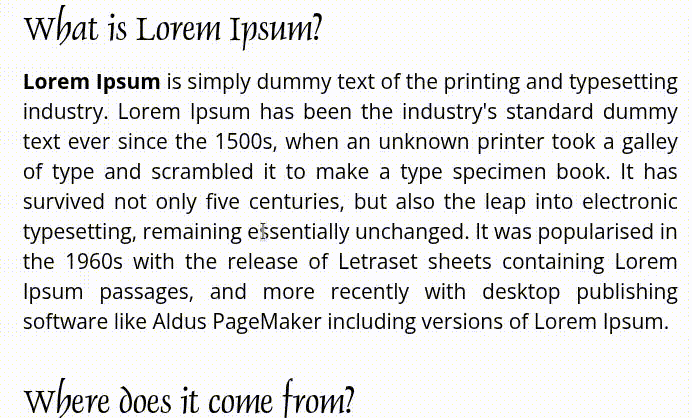

<div align="center">
  <h1>GrabText</h1>
  <p>
    
    
    <a href="https://opensource.org/licenses/MIT"></a>
    
  </p>
    <p>
    Capture e copie texto de qualquer imagem ou vídeo na sua tela. Uma ferramenta de OCR simples e poderosa para sistemas baseadas em Linux.
  </p>
</div>

---

## Sobre o Projeto



**GrabText** é uma ferramenta de produtividade que agiliza o processo de captura de texto de qualquer lugar da tela. Seja de uma imagem, um vídeo, um documento protegido ou uma página web, basta selecionar a área desejada para que o texto seja reconhecido e copiado para sua área de transferência instantaneamente.

Utiliza o **Tesseract** para o reconhecimento de caracteres e o **Flameshot** para uma seleção de tela intuitiva.

---

## Compatibilidade

Este projeto foi desenvolvido e testado para funcionar nos principais ambientes de desktop Linux. A automação de atalhos é mais eficaz nos seguintes ambientes:

* **Ambientes com Suporte Ideal:** GNOME, XFCE
* **Ambientes com Suporte Guiado:** KDE Plasma
* **Distribuições Suportadas:** Qualquer distribuição baseada em `apt` (Debian, Ubuntu), `pacman` (Arch Linux), `dnf` (Fedora), ou `zypper` (openSUSE).

---

## Instalação

1.  **Clone este repositório:**
    ```bash
    git clone https://github.com/rouri404/GrabText.git
    cd GrabText
    ```

2.  **Torne o script de instalação executável:**
    ```bash
    chmod +x install.sh
    ```

3.  **Execute o instalador:**
    ```bash
    ./install.sh
    ```
    O script irá pedir sua senha para instalar os pacotes de sistema (se ainda não estiverem instalados) e irá configurar o restante do ambiente.

---

## Instalação Manual e Pré-requisitos

Caso o script `install.sh` encontre algum erro, você pode instalar as dependências manualmente com os seguintes comandos:

#### Para Arch Linux e derivados (Manjaro, EndeavourOS)
```bash
sudo pacman -S flameshot tesseract tesseract-data-por xclip python-pip
```

#### Para Debian, Ubuntu e derivados (Mint, Pop!_OS)
```bash
sudo apt install flameshot tesseract-ocr tesseract-ocr-por xclip python3-pip
```

#### Para Fedora
```bash
sudo dnf install flameshot tesseract tesseract-langpack-por xclip python3-pip
```

#### Para openSUSE
```bash
sudo zypper install flameshot tesseract-ocr tesseract-ocr-data-por xclip python3-pip
```
Após a instalação manual, continue no passo 2 da seção de **Instalação** abaixo.

---

## Como Usar

1.  Pressione a tecla `INSERT`.
2.  A interface de captura aparecerá. Selecione a área da tela com o texto desejado.
3.  Pressione `Enter` ou clique no ícone de `✓` (Confirmar).
4.  O texto extraído estará na sua área de transferência, pronto para ser colado com \`Ctrl+V\`.

---

## Solução de Problemas e FAQ

<details>
  <summary><strong>O atalho não foi criado automaticamente. Como configuro manualmente?</strong></summary>
  
  Se a automação falhou ou foi pulada, você pode configurar o atalho manualmente em poucos passos. O comando que você precisará usar é o caminho absoluto para o script `launch.sh`, que o instalador criou para você.
  
  **Exemplo do Comando:** `/home/seu-usuario/'Área de trabalho'/GrabText/launch.sh`

  Siga o guia correspondente ao seu ambiente de trabalho:

  #### Para GNOME (Ubuntu, Fedora)
  1.  Abra **Configurações** > **Teclado** > **Atalhos de Teclado**.
  2.  Role até **Atalhos Personalizados** e clique no `+`.
  3.  Preencha os campos:
      * **Nome:** `GrabText`
      * **Comando:** Insira o caminho completo para o arquivo `launch.sh`.
      * **Atalho:** Pressione a tecla `INSERT`.
  4.  Clique em "Adicionar".

  #### Para KDE Plasma
  1.  Abra **Configurações do Sistema** > **Atalhos** > **Atalhos Personalizados**.
  2.  Vá em `Editar` > `Novo` > `Atalho Global` > `Comando/URL`.
  3.  Preencha os campos:
      * **Nome:** `GrabText`
      * Aba **Gatilho**: Pressione a tecla `INSERT`.
      * Aba **Ação**: No campo "Comando/URL", insira o caminho completo para o `launch.sh`.
  4.  Clique em "Aplicar".

  #### Para XFCE
  1.  Vá para **Configurações** > **Teclado** > **Atalhos de aplicativos**.
  2.  Clique em **"Adicionar"**.
  3.  No campo "Comando", insira o caminho completo para o `launch.sh`.
  4.  Quando o sistema pedir a tecla, pressione `INSERT`.
</details>

<details>
  <summary><strong>O OCR não extrai nenhum texto ou o resultado sai incorreto.</strong></summary>
  
  A qualidade do OCR depende 99% da qualidade da imagem. Lembre-se das boas práticas:
  * **Alto Contraste:** Texto escuro sobre fundo claro e sólido funciona melhor.
  * **Fontes Padrão:** Fontes muito artísticas ou pequenas são difíceis de ler.
  * **Boa Resolução:** Se o texto na tela estiver pequeno, use o zoom (`Ctrl` + `+`) na aplicação antes de capturar a tela.
</details>

<details>
  <summary><strong>Como posso personalizar a aparência da interface de captura?</strong></summary>
  
  A aparência da interface é controlada pelo Flameshot. Para personalizar cores, botões e opacidade, execute o seguinte comando no terminal:
  ```bash
  flameshot config
  ```
  O `install.sh` já aplica uma configuração inicial minimalista, mas você pode ajustá-la como preferir através desse painel. Se a aparência não mudar após a edição, tente fechar completamente o Flameshot com `killall flameshot` e acionar o atalho novamente.
</details>

---

## Desinstalação

Para remover o GrabText e seus componentes:

1.  Navegue até a pasta do projeto.
2.  Torne o desinstalador executável:
    ```bash
    chmod +x uninstall.sh
    ```
3.  Execute o script e siga as instruções:
    ```bash
    ./uninstall.sh
    ```