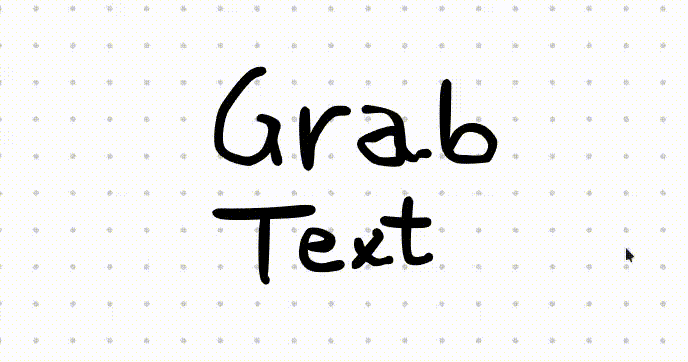

<div align="center">
  <h1>GrabText</h1>
  <p>
    
    
    <a href="https://opensource.org/licenses/MIT"></a>
    
  </p>
    <p>
    OCR instantâneo para qualquer área da sua tela. Um projeto criado para a comunidade Linux.
  </p>
</div>

---

## Sobre o Projeto



**GrabText** é uma ferramenta de produtividade que agiliza o processo de captura de texto de qualquer lugar da tela. Seja de uma imagem, um vídeo, um documento protegido ou uma página web, basta selecionar a área desejada para que o texto seja reconhecido e copiado para sua área de transferência instantaneamente.

Este projeto foi construído utilizando ferramentas poderosas e flexíveis do ecossistema Linux, como Tesseract e Flameshot.

---

## Pré-requisitos

O script `install.sh` tentará instalar todas as dependências automaticamente.

#### Dependências de Sistema
* `flameshot`
* `tesseract-ocr` e `tesseract-ocr-por` (ou `tesseract-data-por`)
* `xclip`
* `python3` e `python3-pip`

#### Dependências Python
* `pytesseract`
* `pillow`

---

## Instalação

1.  **Clone este repositório:**
    ```bash
    git clone https://github.com/rouri404/GrabText.git
    cd GrabText
    ```

2.  **Torne o script de instalação executável:**
    ```bash
    chmod +x install.sh
    ```

3.  **Execute o instalador:**
    ```bash
    ./install.sh
    ```
    O script irá pedir sua senha para instalar os pacotes de sistema e irá configurar o restante do ambiente.

---

## Configurando o Atalho Manualmente

Caso a configuração automática de atalho falhe ou seja pulada, siga este guia. Primeiro, identifique seu ambiente de trabalho:
```bash
echo \$XDG_CURRENT_DESKTOP
```

#### Para GNOME (Ubuntu, Fedora)
1.  Abra **Configurações** > **Teclado** > **Atalhos de Teclado**.
2.  Role até **Atalhos Personalizados** e clique no `+`.
3.  Preencha os campos:
    * **Nome:** `GrabText`
    * **Comando:** Cole o comando completo exibido pelo `install.sh`.
    * **Atalho:** Pressione a tecla `INSERT`.
4.  Clique em "Adicionar".

#### Para KDE Plasma
1.  Abra **Configurações do Sistema** > **Atalhos** > **Atalhos Personalizados**.
2.  Vá em `Editar` > `Novo` > `Atalho Global` > `Comando/URL`.
3.  Preencha os campos:
    * **Nome:** `GrabText`
    * Aba **Gatilho**: Pressione a tecla `INSERT`.
    * Aba **Ação**: Cole o comando completo exibido pelo `install.sh`.
4.  Clique em "Aplicar".

#### Para XFCE
1.  Vá para **Configurações** > **Teclado** > **Atalhos de aplicativos**.
2.  Clique em **"Adicionar"**.
3.  No campo "Comando", cole o comando completo exibido pelo `install.sh`.
4.  Quando o sistema pedir a tecla, pressione `INSERT`.

---

## Como Usar

1.  Pressione a tecla `INSERT`.
2.  A interface de captura aparecerá. Selecione a área da tela com o texto desejado.
3.  Pressione `Enter` ou clique no ícone de `✓` (Confirmar).
4.  O texto extraído estará na sua área de transferência, pronto para ser colado com `Ctrl+V`.

---

## Configuração Adicional

A aparência da interface de captura é controlada pelo Flameshot. Para personalizar cores, botões e opacidade, execute:
```bash
flameshot config
```

---

## Desinstalação

Para remover o GrabText e seus componentes:

1.  Navegue até a pasta do projeto.
2.  Torne o desinstalador executável:
    ```bash
    chmod +x uninstall.sh
    ```
3.  Execute o script e siga as instruções:
    ```bash
    ./uninstall.sh
    ```

---

## Solução de Problemas (FAQ)

<details>
  <summary><strong>O atalho com a tecla INSERT não faz nada. O que pode ser?</strong></summary>
  
  Este é o problema mais comum e geralmente ocorre porque o ambiente em que os atalhos são executados é mais limitado que o seu terminal. A solução é garantir que o comando no atalho seja "autossuficiente". 
  
  Certifique-se de que o comando no seu atalho de teclado seja exatamente este, que inclui a definição do `PATH`:
  
  `bash -c "export PATH=/usr/bin:/bin:/usr/local/bin:$HOME/.local/bin; flameshot gui --raw | '$HOME/Área de trabalho/GrabText/.venv/bin/python' '$HOME/Área de trabalho/GrabText/grabtext.py'"`
</details>

<details>
  <summary><strong>O OCR não extrai nenhum texto ou o resultado sai incorreto.</strong></summary>
  
  A qualidade do OCR depende 99% da qualidade da imagem. Lembre-se das boas práticas:
  * **Alto Contraste:** Texto escuro sobre fundo claro e sólido funciona melhor.
  * **Fontes Padrão:** Fontes muito artísticas ou pequenas são difíceis de ler.
  * **Boa Resolução:** Se o texto na tela estiver pequeno, use o zoom (`Ctrl` + `+`) na aplicação antes de capturar a tela.
</details>

<details>
  <summary><strong>A aparência do Flameshot não muda, mesmo depois de editar a configuração.</strong></summary>
  
  O Flameshot pode ser teimoso com suas configurações. Tente o seguinte:
  1.  Feche completamente qualquer instância do Flameshot rodando em segundo plano: `killall flameshot`.
  2.  Abra o painel de configuração (`flameshot config`), clique em "Reset to defaults", e reconfigure a aparência manualmente.
  3.  Alternativamente, verifique seu arquivo `~/.config/flameshot/flameshot.ini` e delete a linha que começa com `buttons=@Variant(...)`, pois ela sobrescreve as configurações de botões.
</details>
